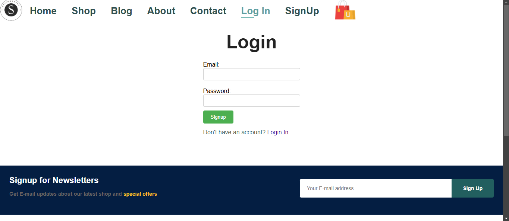

#StitchStyle Ecommerce Website
StitchStyle is an ecommerce website built using mern stack which has an admin panel and working login and signup functions also has a cart .





## Installation Guide

### Requirements
- [Nodejs](https://nodejs.org/en/download)
- [Mongodb](https://www.mongodb.com/docs/manual/administration/install-community/)

Both should be installed and make sure mongodb is running.
### Installation

#### First Method
```shell
https://github.com/yash-vardhan-singh07/StitchStyle.git
cd StitchStyle
```
How to run 
```shell
cd Ecommerce
npm intall
npm start
cd ..
cd server
npm intall
npm run dev
```
Done! Now open localhost:51730 in your browser.
